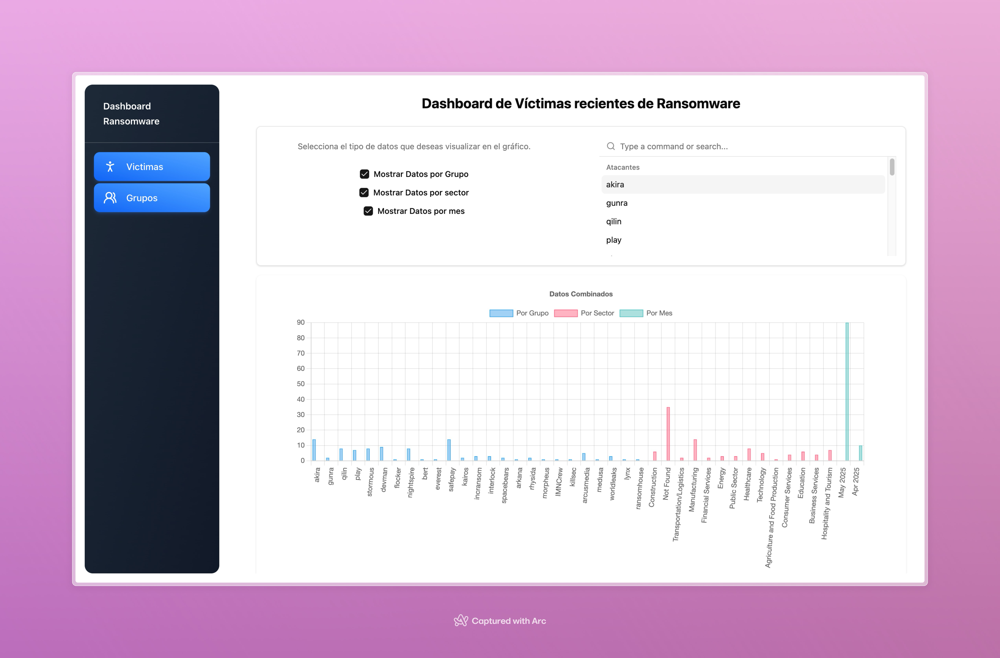
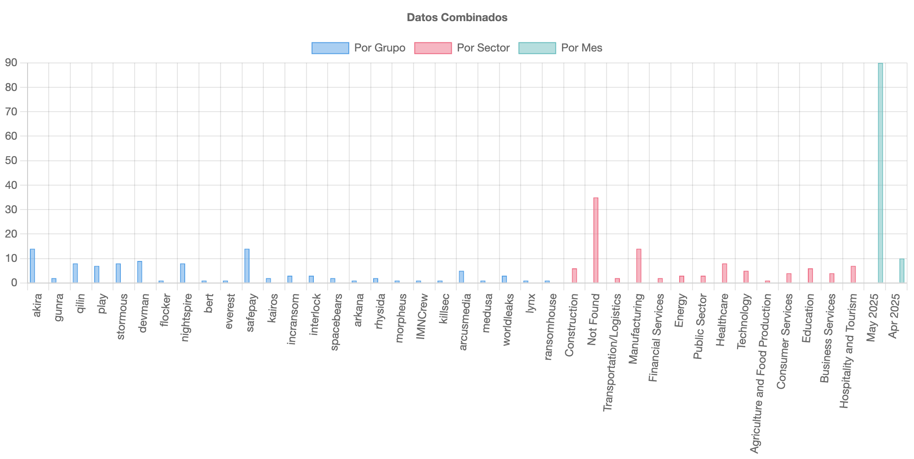
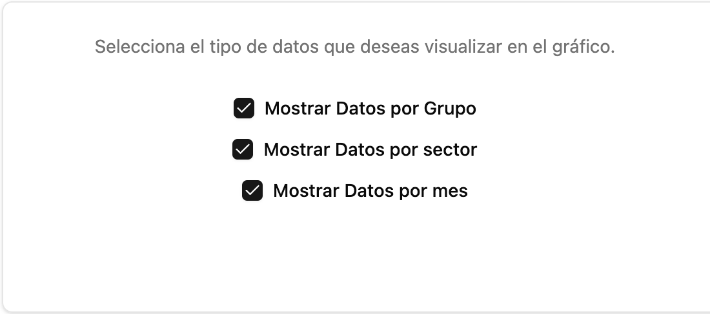
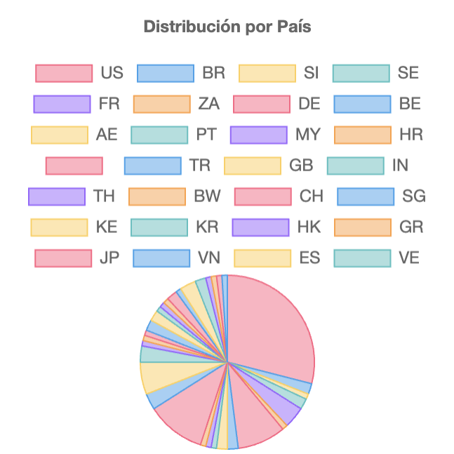
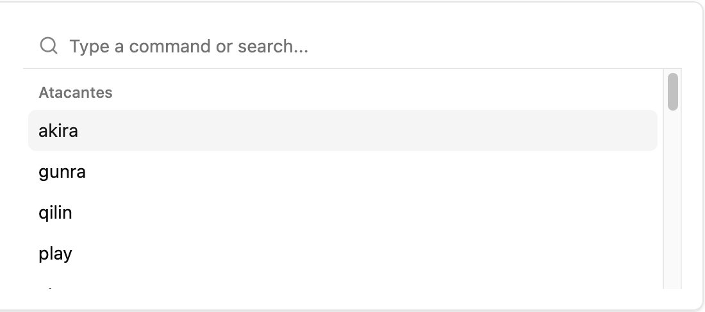

# Lumu Challenge Project

## Overview

This project is built with React, TypeScript, and Vite.

## Tech Stack

### Core Technologies

- **React 18+**
- **TypeScript**
- **Vite**

### Additional Libraries & Tools

- **Shadcn**
- **Chart.js**
- **React-chartjs-2**
- **Tailwind**
- **Tanstack Query**

## Setup Instructions

### Prerequisites

- Node.js (v16.0.0 or higher)
- pnpm (v7.0.0 or higher)

### Installation

1. Clone the repository:

   ```bash
   git clone https://github.com/juanleon8581/lumu-challenge
   cd lumu-challenge
   ```

2. Install dependencies:

   ```bash
   pnpm install
   ```

3. Start the development server:

   ```bash
   pnpm dev
   ```

4. Open your browser and navigate to `http://localhost:5173`

## Deployment

### Building for Production

```bash
pnpm build
```

The build artifacts will be stored in the `dist/` directory, ready to be deployed to any static hosting service.

## Data processing Info



- To obtain information we used the endponint “/recentvictims”, after having this information in a JSON with its respective interface “IVictimAPI”, it was processed and transformed into data with its own interface “IVictim” where we rescued the most relevant data to build the graphs of such information.



- After having all our information in the format of interest, the information is processed to generate specific groups “Groups of attackers, country, sector and month”.



- Once the information has been grouped, it is passed to the graphics components to be displayed and filtered at the user's discretion.



- Also analyzing the endpoint “/group/<group_name>” we could find the existence of a URL that contains the information of groups, this can be accessed through a list of groups that is also rescued from the endpoin of victims and this URL is built dynamically to visit this site of interest.


